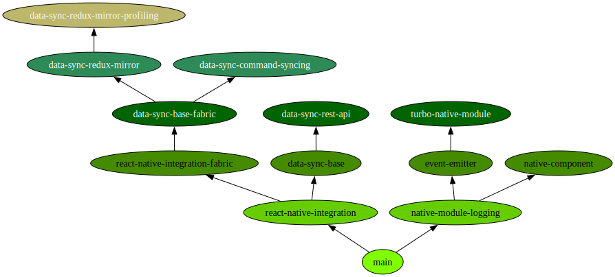

# React Native Brownfield Examples

This repository contains examples for brown-fielding existing iOS and Android apps using React Native. The examples are divided by topic and can be found in separate branches. These branches were created based on the chapters of my bachelor's thesis.

## Branch Overview

| Branch                                                                                                                                  | Description                                                                                                                                           | Section in Thesis                                                 | Branch Diff                                                                                                                                                                                                                                                                                                                          |
| --------------------------------------------------------------------------------------------------------------------------------------- | ----------------------------------------------------------------------------------------------------------------------------------------------------- | ----------------------------------------------------------------- | ------------------------------------------------------------------------------------------------------------------------------------------------------------------------------------------------------------------------------------------------------------------------------------------------------------------------------------ |
| [main](https://github.com/flokol120/react-native-brownfield-examples/tree/main)                                                         | Base branch with empty native iOS and Android apps.                                                                                                   | -                                                                 | -                                                                                                                                                                                                                                                                                                                                    |
| [native-module-logging](https://github.com/flokol120/react-native-brownfield-examples/tree/native-module-logging)                       | Implementation of a basic native module that logs within the native apps.                                                                             | [4.2](./thesis.pdf#section.4.2)                                   | [main..native-module-logging](https://github.com/flokol120/react-native-brownfield-examples/compare/main..native-module-logging)                                                                                                                                                                                                     |
| [event-emitter](https://github.com/flokol120/react-native-brownfield-examples/tree/event-emitter)                                       | Implementation of an event emitter used to log a message from iOS/Android to React Native.                                                            | [4.3](./thesis.pdf#section.4.3)                                   | [native-module-logging..event-emitter](https://github.com/flokol120/react-native-brownfield-examples/compare/native-module-logging..event-emitter)                                                                                                                                                                                   |
| [turbo-native-module](https://github.com/flokol120/react-native-brownfield-examples/tree/turbo-native-module)                           | Same as `native-module-logging`, but using a Turbo Native Module (new architecture).                                                                  | [4.4](./thesis.pdf#section.4.4)                                   | [event-emitter..turbo-native-module](https://github.com/flokol120/react-native-brownfield-examples/compare/event-emitter..turbo-native-module)                                                                                                                                                                                       |
| [native-component](https://github.com/flokol120/react-native-brownfield-examples/tree/native-component)                                 | Implementation of a basic native component by wrapping horizontal progress bars.                                                                      | [4.5](./thesis.pdf#section.4.5)                                   | [native-module-logging..native-component](https://github.com/flokol120/react-native-brownfield-examples/compare/native-module-logging..native-component)                                                                                                                                                                             |
| [react-native-integration](https://github.com/flokol120/react-native-brownfield-examples/tree/react-native-integration)                 | Integration of React Native into the existing apps from main.                                                                                         | [5.1](./thesis.pdf#section.5.1) - [5.4](./thesis.pdf#section.5.4) | [main..react-native-integration](https://github.com/flokol120/react-native-brownfield-examples/compare/main..react-native-integration)                                                                                                                                                                                               |
| [react-native-integration-fabric](https://github.com/flokol120/react-native-brownfield-examples/tree/react-native-integration-fabric)   | Activation of the new architecture (Fabric) within the integration of React Native.                                                                   | [5.5](./thesis.pdf#section.5.5)                                   | [react-native-integration..react-native-integration-fabric](https://github.com/flokol120/react-native-brownfield-examples/compare/react-native-integration..react-native-integration-fabric)                                                                                                                                         |
| [data-sync-base](https://github.com/flokol120/react-native-brownfield-examples/tree/data-sync-base)                                     | Implementation of a mock database within the native apps, as well as integration of Redux in React Native.                                            | -                                                                 | [react-native-integration..data-sync-base](https://github.com/flokol120/react-native-brownfield-examples/compare/react-native-integration..data-sync-base)                                                                                                                                                                           |
| [data-sync-base-fabric](https://github.com/flokol120/react-native-brownfield-examples/tree/data-sync-base-fabric)                       | Same as data-sync-base, but using react-native-integration-fabric as the base (cherry-picked from `data-sync-base`).                                  | -                                                                 | [data-sync-base..data-sync-base-fabric](https://github.com/flokol120/react-native-brownfield-examples/compare/data-sync-base..data-sync-base-fabric)   [react-native-integration..data-sync-base-fabric](https://github.com/flokol120/react-native-brownfield-examples/compare/react-native-integration..data-sync-base-fabric) |
| [data-sync-redux-mirror](https://github.com/flokol120/react-native-brownfield-examples/tree/data-sync-redux-mirror)                     | Data synchronization between the native mock DB and Redux is achieved by mirroring the Redux state in the native apps.                                | [6.1](./thesis.pdf#section.6.1)                                   | [data-sync-base-fabric..data-sync-redux-mirror](https://github.com/flokol120/react-native-brownfield-examples/compare/data-sync-base-fabric..data-sync-redux-mirror)                                                                                                                                                                 |
| [data-sync-redux-mirror-profiling](https://github.com/flokol120/react-native-brownfield-examples/tree/data-sync-redux-mirror-profiling) | Adjustments to `data-sync-redux-mirror` in order to be able to undertake a performance profiling.                                                     | [6.1](./thesis.pdf#section.6.1)                                   | [data-sync-redux-mirror..data-sync-redux-mirror-profiling](https://github.com/flokol120/react-native-brownfield-examples/compare/data-sync-redux-mirror..data-sync-redux-mirror-profiling)                                                                                                                                           |
| **→ [data-sync-rest-api](https://github.com/flokol120/react-native-brownfield-examples/tree/data-sync-rest-api)**                       | **Data synchronization between the native mock DB and Redux by re-implementing server API endpoints within the native apps as well as React Native.** | **[6.2](./thesis.pdf#section.6.2)**                               | **[data-sync-base..data-sync-rest-api](https://github.com/flokol120/react-native-brownfield-examples/compare/data-sync-base..data-sync-rest-api)**                                                                                                                                                                                   |
| [data-sync-command-syncing](https://github.com/flokol120/react-native-brownfield-examples/tree/data-sync-command-syncing)               | Data synchronization between the native mock DB and Redux by using a synchronization strategy leveraging the command pattern.                         | [6.3](./thesis.pdf#section.6.3)                                   | [data-sync-base-fabric..data-sync-command-syncing](https://github.com/flokol120/react-native-brownfield-examples/compare/data-sync-base-fabric..data-sync-command-syncing)                                                                                                                                                           |
